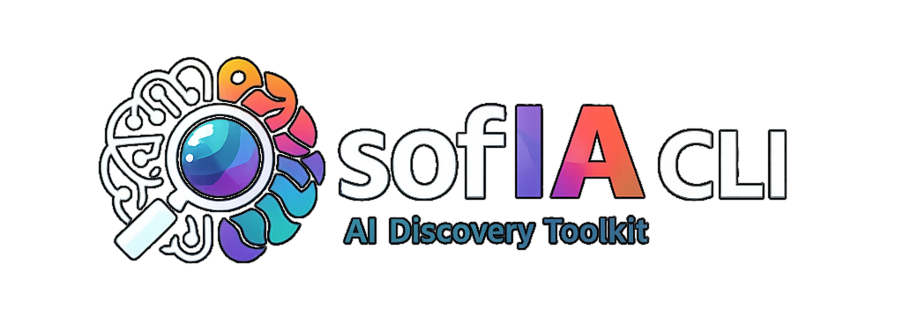

# sofIA — AI Discovery Workshop CLI

[ ](https://www.npmjs.com/package/@jmservera/sofia-cli)

[](https://www.npmjs.com/package/@jmservera/sofia-cli)

**sofIA** is an agentic CLI that guides facilitators through a structured AI Discovery Workshop — from understanding a business and brainstorming AI use cases, all the way to generating a working proof-of-concept. It reimagines two Microsoft open-source projects using the GitHub Copilot SDK for Node.js and extends them with idea selection, planning, and autonomous code generation.

## Origins

sofIA builds on and extends two upstream projects:

### 1. [AI Discovery Agent (AIDA)](https://github.com/microsoft/ai-discovery-agent/)

Microsoft's AI Discovery Agent is a Python/LangGraph agent that facilitates AI Discovery Workshops — structured sessions where organizations identify high-value AI use cases. AIDA walks participants through business analysis, workflow mapping, and idea generation using multi-agent orchestration.

**What sofIA takes from AIDA**: The workshop facilitation methodology, multi-phase agent flow (Discover → Ideate → Design), prompt engineering patterns for business analysis, and the overall goal of making AI discovery accessible and structured.

**What sofIA changes**: Rebuilt from Python/LangGraph to **Node.js/TypeScript** using the **GitHub Copilot SDK**. Runs as a CLI rather than a notebook/web interface. Adds three phases beyond AIDA's scope: idea **Selection**, implementation **Planning**, and PoC **Development**.

### 2. [AI Discovery Cards Agent](https://github.com/microsoft-partner-solutions-ai/agent-guides/tree/main/ai-discovery-cards-agent)

The AI Discovery Cards Agent is a guided workshop framework that uses a deck of "AI Envisioning Cards" to help teams systematically map AI capabilities to their workflow steps. Each card represents an AI pattern (e.g., anomaly detection, content generation, predictive analytics) that participants score and align to business activities.

**What sofIA takes from AI Discovery Cards**: The 12-step methodology, the card deck and scoring system, the workflow-to-card mapping approach, and the idea evaluation framework using feasibility/value matrices.

**What sofIA changes**: Implements the full 12-step process as an interactive CLI agent rather than a facilitation guide. Automates card presentation, scoring aggregation, and idea generation. Extends the process with autonomous idea selection based on structured criteria.

## What sofIA Does

sofIA implements a **6-phase agentic pipeline** as an interactive CLI:

```
Discover → Ideate → Design → Select → Plan → Develop
```

| Phase        | What happens                                                                                                                                |
| ------------ | ------------------------------------------------------------------------------------------------------------------------------------------- |
| **Discover** | Understand the business, challenges, and constraints. Choose a focus topic.                                                                 |
| **Ideate**   | Brainstorm activities, map workflows, explore AI Envisioning Cards, score and map them to workflow steps.                                   |
| **Design**   | Generate idea cards with descriptions, workflow coverage, and aspirational scope.                                                           |
| **Select**   | Evaluate ideas on feasibility/value, select the most promising one with transparent rationale.                                              |
| **Plan**     | Create an implementation plan with milestones, architecture notes, dependencies, and PoC scope.                                             |
| **Develop**  | Generate a proof-of-concept repository using a **Ralph loop** — an autonomous cycle of code generation, testing, and LLM-driven refinement. |

### The Ralph Loop

The Develop phase uses an iterative code generation pattern inspired by [Geoffrey Huntley's Ralph concept](https://ghuntley.com/ralph/): the LLM generates code, tests run, failures are fed back as context, and the LLM refines until tests pass or the iteration limit is reached. This produces a working PoC without manual code authoring.

### MCP Integrations

sofIA uses [Model Context Protocol](https://modelcontextprotocol.io/) servers to enrich its context:

| Server             | Purpose                                                      |
| ------------------ | ------------------------------------------------------------ |
| **GitHub MCP**     | Repository creation for PoCs, code search, issue tracking    |
| **Context7**       | Up-to-date library and framework documentation               |
| **Microsoft Docs** | Azure resource management, cloud architecture guidance       |
| **WorkIQ**         | Microsoft 365 process analysis (emails, meetings, documents) |
| **Playwright**     | Browser automation for web research and PoC testing          |

## Tech Stack

- **Runtime**: Node.js (>=20 LTS) with TypeScript (ES2022 target, ESM)
- **SDK**: [@github/copilot-sdk](https://www.npmjs.com/package/@github/copilot-sdk) for LLM orchestration
- **CLI**: [Commander.js](https://github.com/tj/commander.js) with interactive menus via [@inquirer/prompts](https://github.com/SBoudrias/Inquirer.js)
- **Testing**: [Vitest](https://vitest.dev/) with v8 coverage
- **Logging**: [Pino](https://getpino.io/) with PII redaction
- **Schemas**: [Zod v4](https://zod.dev/) for session validation

## Quick Start

```bash
# Prerequisites: Node.js >= 20, a GitHub Copilot subscription

# Install as a dev dependency in your project
npm install -D @jmservera/sofia-cli

# Run with npx (recommended)
npx sofia workshop

# Or install globally
npm install -g @jmservera/sofia-cli
sofia workshop

# Check session status
npx sofia status

# Generate a PoC from a completed session
npx sofia dev --session <id>

# Export workshop artifacts
npx sofia export --session <id>

# Deploy Azure AI Foundry infrastructure
npx sofia infra deploy -g sofia-workshop-rg

# Gather environment values from an existing deployment
npx sofia infra gather-env -g sofia-workshop-rg

# Tear down infrastructure
npx sofia infra teardown -g sofia-workshop-rg --yes
```

### Development Setup

If you want to contribute or run from source:

```bash
git clone https://github.com/jmservera/sofia-cli.git
cd sofia-cli
npm install
npm run start -- workshop
```

## CLI Commands

| Command                  | Description                                          |
| ------------------------ | ---------------------------------------------------- |
| `sofia workshop`         | Start or resume an AI Discovery Workshop session     |
| `sofia dev`              | Generate and refine a PoC from a completed session   |
| `sofia status`           | Display session status and next actions              |
| `sofia export`           | Export workshop artifacts as Markdown + JSON         |
| `sofia infra deploy`     | Deploy Azure AI Foundry resources                    |
| `sofia infra gather-env` | Fetch environment values from an existing deployment |
| `sofia infra teardown`   | Remove Azure AI Foundry resources                    |

See [docs/cli-usage.md](docs/cli-usage.md) for full command reference.

## Project Structure

```
infra/                # Azure AI Foundry IaC (Bicep + deployment scripts)
├── main.bicep        # Foundry account, project, model deployment
├── resources.bicep   # Resource-group-scoped resources (module)
├── main.bicepparam   # Default parameters
├── deploy.sh         # One-command deployment
└── teardown.sh       # Resource group deletion

src/
├── cli/              # Command handlers (workshop, dev, status, export)
├── develop/          # PoC generation & Ralph loop
│   ├── ralphLoop.ts          # Autonomous iteration orchestrator
│   ├── dynamicScaffolder.ts  # LLM-based project scaffolding
│   ├── codeGenerator.ts      # LLM-driven code generation
│   ├── testRunner.ts         # Test execution & result parsing
│   ├── checkpointState.ts    # Resume/checkpoint detection
│   └── ...
├── loop/             # Multi-turn conversation orchestrator
├── phases/           # Phase handlers & JSON extractors
├── prompts/          # Versioned prompt templates
├── sessions/         # Session persistence & export
├── mcp/              # MCP server connection manager & transports
├── shared/           # Schemas, events, error classification
│   └── schemas/      # Zod schemas for session state
└── vendor/           # Re-exports of external packages

specs/
├── 001-cli-workshop-rebuild/       # Workshop phases orchestration
├── 002-poc-generation/             # Develop phase & Ralph loop
├── 003-mcp-transport-integration/  # Real MCP server connections
├── 004-dev-resume-hardening/       # Checkpoint, resume, --force
├── 005-ai-search-deploy/           # Azure AI Foundry infrastructure
└── 006-workshop-extraction-fixes/  # Extraction, wiring, context mgmt

docs/                 # User-facing documentation
tests/
├── unit/             # Single-module tests
├── integration/      # Multi-module flow tests
├── e2e/              # PTY-based interactive tests
└── live/             # Tests requiring real MCP/LLM access
```

## Development

```bash
# Run all tests
npm test

# Run specific test suites
npm run test:unit
npm run test:integration
npm run test:e2e

# Run live tests (requires SOFIA_LIVE_MCP_TESTS=true and real MCP access)
SOFIA_LIVE_MCP_TESTS=true npm test

# Watch mode (auto-reloads)
npm run dev -- workshop

# Lint & typecheck
npm run lint
npm run typecheck
```

### TDD Workflow

All changes follow **Red → Green → Review**:

1. Write a failing test first
2. Implement the minimum code to make it pass
3. Review for edge cases and add tests if gaps found
4. Run the full suite before committing

See [.github/copilot-instructions.md](.github/copilot-instructions.md) for detailed conventions.

## Documentation

| Document                                       | Contents                               |
| ---------------------------------------------- | -------------------------------------- |
| [docs/cli-usage.md](docs/cli-usage.md)         | Commands, flags, examples              |
| [docs/session-model.md](docs/session-model.md) | Session lifecycle, phases, persistence |
| [docs/export-format.md](docs/export-format.md) | Export artifacts and summary JSON      |
| [docs/environment.md](docs/environment.md)     | Environment variable configuration     |
| [docs/architecture.md](docs/architecture.md)   | Module overview and data flow          |

## Current Status

All six features have been implemented and tested:

| Feature | Title                                                           | Description                                                            | Status          |
| ------- | --------------------------------------------------------------- | ---------------------------------------------------------------------- | --------------- |
| 001     | [Workshop Rebuild](specs/001-cli-workshop-rebuild/spec.md)      | 5-phase orchestration (Discover → Plan), session persistence, export   | **Implemented** |
| 002     | [PoC Generation](specs/002-poc-generation/spec.md)              | Develop phase with Ralph loop, LLM-based dynamic scaffolding           | **Implemented** |
| 003     | [MCP Transport](specs/003-mcp-transport-integration/spec.md)    | Real MCP tool invocation (GitHub, Context7, Azure, web search, WorkIQ) | **Implemented** |
| 004     | [Dev Hardening](specs/004-dev-resume-hardening/spec.md)         | Checkpoint/resume, `--force` flag, template registry, test coverage    | **Implemented** |
| 005     | [Search Deployment](specs/005-ai-search-deploy/spec.md)         | Azure AI Foundry Bicep infrastructure with one-command deploy/teardown | **Implemented** |
| 006     | [Extraction Fixes](specs/006-workshop-extraction-fixes/spec.md) | Fallback extraction, MCP wiring per phase, context window management   | **Implemented** |

## Web Search Setup

sofIA can search the web during the Discover phase to research companies, competitors, and industry trends. This requires an Azure AI Foundry deployment.

**Quick setup:**

```bash
# Deploy infrastructure (requires Azure CLI + subscription)
npx sofia infra deploy -g sofia-workshop-rg

# Gather environment values into .env
npx sofia infra gather-env -g sofia-workshop-rg

# Configure sofIA with the output values
export FOUNDRY_PROJECT_ENDPOINT="<endpoint from deploy output>"
export FOUNDRY_MODEL_DEPLOYMENT_NAME="gpt-4.1-mini"

# Teardown when done
npx sofia infra teardown -g sofia-workshop-rg --yes
```

See [specs/005-ai-search-deploy/quickstart.md](specs/005-ai-search-deploy/quickstart.md) for detailed deployment instructions.

## License

See [LICENSE](LICENSE) for details.
